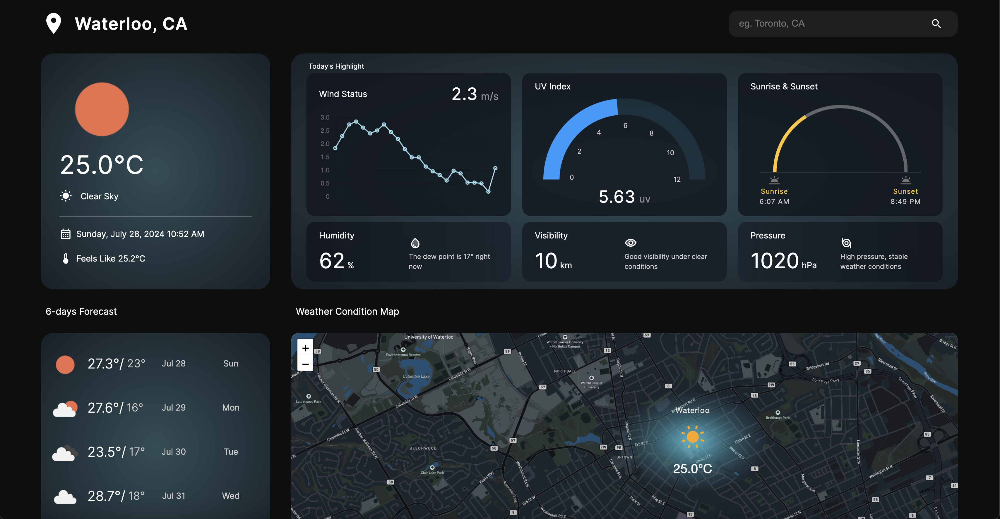

# Weather Forecast
## Project Overview :
A weather application that provides weather information based on the user's location input. The application fetches meteorological data points and a five-day forecast from the [OpenWeatherMap API](https://openweathermap.org/).

## App Features :
1) Location Input: Users can enter a city name to fetch weather data.
2) Current Weather: Displays current weather conditions including temperature, humidity, wind speed, and weather description.
3) Five-Day Forecast: Provides a forecast for the next five days, temperature highs and lows, and weather conditions.

## Technologies Used:
1) Frontend: React.js / Next.js
2) Backend: Node.js/Express.js to handle API requests and interact with OpenWeatherMap API.
3) Styling: CSS for styling components and ensuring a visually appealing layout.

## Set up backend
1) Obtain an API key from [OpenWeatherMap](https://openweathermap.org/)
2) Obtain an API key from [GeoDBCities](https://rapidapi.com/wirefreethought/api/geodb-cities)
3) Rename .variables.env.tmp to .variables.env 
> OPENWEATHER_API_KEY=\<your-OpenWeather-API-key\>

> GEO_API_KEY=\<your-GEO-API-key\>
4) cd backend
5) npm install

## Set up frontend
1) cd frontend
2) npm install

## Start server
1) cd backend
2) npm start

## Start react app
1) cd frontend
2) npm run dev
